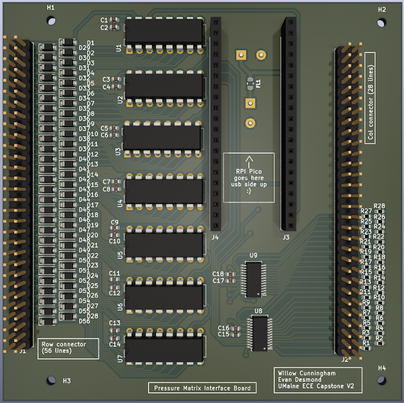

# Pressure Mat Project

This git repository contains all the code developed for the Electrical and Computer Engineering Capstone project of Evan Desmond and Willow Cunningham at the University of Maine, Orono. 

## The Mat

The pressure sensing mat uses the intersections between rows and columns of copper tape separated by velostat to form resistive pressure sensors. The mat has 28 rows and 56 columns, for a total of 1568 sensors at a resolution of 1cm^2.

## The PCB

Schematics for the PCB are in ```/board_kicad``` A render of the pcb is shown below.



## The Code

Code for the project is split into two primary parts: embedded side and host side.

### Embedded Code

The code that the RPI Pico runs is in the ```/board_code``` directory. It is responsible for controlling the ADCs and shift registers on the PCB in order to read the pressure sensors in the mat, and transmitting the mat data over USB serial to the connected host computer.

### Host Code

The python program in ```/GUI```  is used to view data recorded and transmitted by the interface board.
