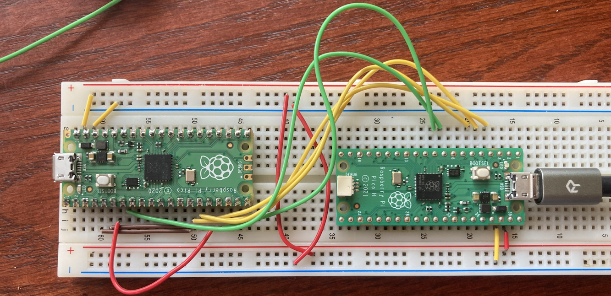

# Board Side Code

This directory holds the embedded code responsible for interfacing with the PCB ADC's and communicating with the connected laptop

## Usage

### Build the code:
1. Enter a linux environment (WSL)
2. 
        mkdir build
        cd build
        export PICO_SD_PATH=../relative/path/to/the/cloned/directory/named/pico-sdk
        cmake ..
        make

3. Copy the uf2 file to the pico's flash to program it

### Development stage: simulated ADC

In early development, prior to acquiring components and finalizing the circuit schematic, development is aided by simulating the two ADC's on another RPI Pico. The connections needed for this schematic setup are shown below, where the leftmost pico is running the fake ADC code from ```/tests/dummy_MAX11643BEEG/``` and the rightmost pico is running the code from this directory:

