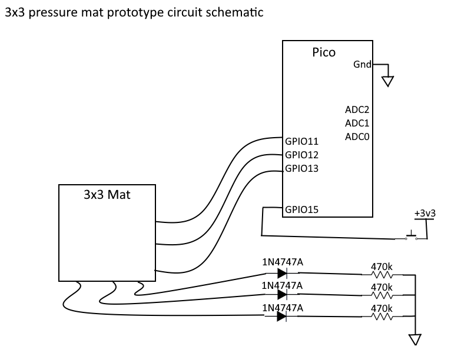
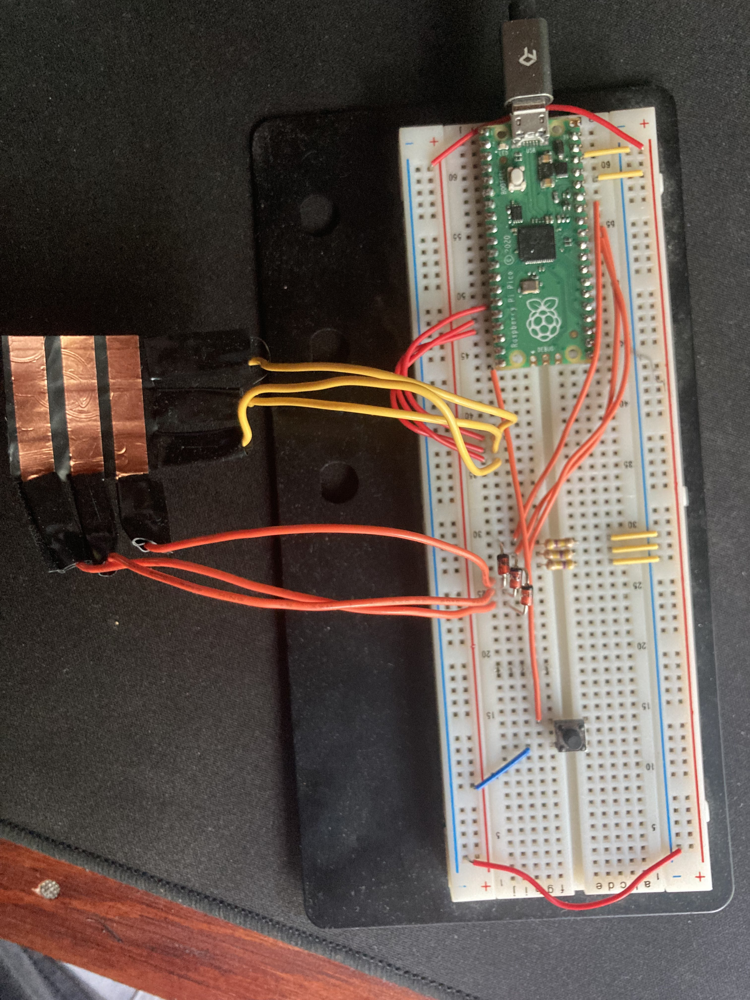

# 3x3 mat prototype using an RPI pico

## Usage
1. Flash the board using rshell https://github.com/dhylands/rshell or any other means  
```
>rshell
>cp board.py /pyboard/main.py
```
2. Unpower and re-connect the pico board to restart it
3. Run the host script using ```py .\host.py```
4. Enter the com port the pico is connected to and hit connect

## Schematic


## Constructed Circuit


